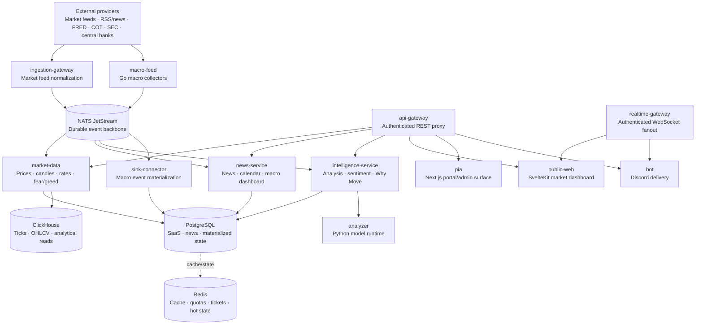

# ATLSD

## Event-driven market intelligence

ATLSD is a multi-tenant market intelligence platform for live market data, financial news, macroeconomic context, sentiment, explainability, and real-time delivery. It combines domain services, versioned event contracts, durable NATS JetStream streams, analytical storage, and web/API clients.

> **Project status:** ATLSD is under active development. Some providers, endpoints, dashboards, and operational workflows are optional or still evolving. Treat source code and deployment configuration as the operational source of truth.

## Capabilities

- Market prices, historical candles, sessions, data quality, spikes, alerts, options, and institutional data.
- Forex and stock news, economic calendar data, macro signals, SEC filings, central-bank documents, and geopolitical signals.
- Treasury yield curves, yield spreads, FRED economic series, energy series, COT positioning, and an ATLSD composite Fear & Greed index.
- Sentiment analysis and Why Did It Move explanations through the intelligence service and analyzer runtime.
- REST and WebSocket delivery for public clients, a SvelteKit market dashboard, a Next.js portal/admin surface, and Discord bot delivery.
- Tenant-aware users, plans, API keys, quotas, configuration, usage tracking, and runtime entitlements.
- Prometheus/Grafana/Loki observability and blue-green application deployment with Docker Compose.

## Current architecture



### Service map

| Component | Responsibility | Runtime |
| --- | --- | --- |
| `api-gateway` | Authenticated REST entrypoint, routing, API-key usage logging, and quota middleware | Rust/Axum |
| `realtime-gateway` | WebSocket authentication, subscriptions, snapshots, durable consumers, fanout, and backpressure handling | Rust/Axum |
| `market-data` | Market prices/history, sessions, quality, spikes, rates, macro indicators, Fear & Greed, options, energy, and COT APIs | Rust/Axum |
| `news-service` | Forex/stock news, calendar, source status, macro dashboard, geopolitical, SEC, and central-bank APIs | Rust/Axum |
| `intelligence-service` | Text analysis, sentiment, Why Did It Move, factor and evidence workflows | Rust/Axum |
| `ingestion-gateway` | Vendor market-feed sessions, normalization, bounded publishing queues, and raw market events | Rust/Tokio |
| `macro-feed` | FRED rate/spread collection and TradingEconomics bond snapshot collection | Go |
| `sink-connector` | Durable macro-event consumer that writes rates, spreads, series, observations, bonds, and scraped news updates to PostgreSQL | Rust/Tokio |
| `control-plane` | Users, authentication, plans, API keys, tenant configuration, quotas, and usage | Rust/Axum |
| `analyzer` | Internal FinBERT/language/model runtime used by intelligence workflows | Python |
| `social-worker` | Social/X-compatible polling and `social.posts` publishing | Python |
| `bot` | Discord integration and delivery | Rust |
| `db-migrate` | Ordered PostgreSQL and ClickHouse migrations with checksums and baselining | Rust |

Shared crates live under `crates/`: authentication/security helpers, common configuration/errors, domain models, event contracts, event-bus adapters, and observability.

## Event architecture

NATS JetStream is the preferred durable event backbone. Events use versioned subjects and contracts such as:

```text
md.raw.*
md.canonical.ticks.v1
md.canonical.ohlcv.1m.v1
news.raw.article.v1
news.enriched.article.v1
intelligence.why_move.generated.v1
intelligence.factor.updated.v1
tenant.entitlement.changed.v1
usage.api.requested.v1
```

The shared `EventEnvelope<T>` carries an event ID, type, schema version, timestamps, source, partition key, metadata, and payload. Consumers should validate versions, process idempotently, and materialize state only after successful validation. Invalid or unprocessable messages are routed to domain-specific dead-letter workflows where configured.

Redis remains responsible for cache, counters, quotas, single-use WebSocket tickets, hot state, and transitional compatibility pub/sub. It is not the source of truth for durable domain events.

## Data stores

| Store | Primary responsibilities |
| --- | --- |
| PostgreSQL | Users, tenants, plans, API keys, configuration, usage, news, latest prices, macro rates/spreads/series, Fear & Greed records, and materialized application state |
| ClickHouse | Market tick tape, OHLCV/time-series workloads, volatility and analytical reads |
| NATS JetStream | Durable, replayable service-to-service events, consumer groups, acknowledgements, and DLQ workflows |
| Redis | Cache, counters, quota state, WebSocket tickets, hot state, and transitional pub/sub |

## API surface

`api-gateway` is the protected REST entrypoint. Clients must supply an API key through the deployment's supported authentication mechanism. The examples below intentionally use placeholders and must not be replaced in documentation with real credentials.

| Route family | Owner |
| --- | --- |
| `/api/v1/market/*` | `market-data` |
| `/api/v1/rates/*` | `market-data` |
| `/api/v1/energy/*` | `market-data` |
| `/api/v1/cot/*` | `market-data` |
| `/api/v1/fear-greed*` | `market-data` |
| `/api/v1/options/*` | `market-data` |
| `/api/v1/forex/*` | `news-service` |
| `/api/v1/stock/*` | `news-service` |
| `/api/v1/macro/*` | `news-service` |
| `/api/v1/geosignals*` | `news-service` |
| `/api/v1/sec/*` | `news-service` |
| `/api/v1/central-banks/*` | `news-service` |
| `/api/v1/analyze` | `intelligence-service` |
| `/api/v1/market/why/*` | `intelligence-service` |

Important current endpoints include:

```text
GET /health
GET /api/v1/market/prices
GET /api/v1/market/history/{symbol}
GET /api/v1/rates/yield-curve?country=US
GET /api/v1/rates/spreads?country=US
GET /api/v1/rates/history/{tenor}?country=US
GET /api/v1/fear-greed?scope=global
GET /api/v1/fear-greed/history?scope=global
GET /api/v1/fear-greed/components?scope=global
GET /api/v1/options/summary?symbol={symbol}
GET /api/v1/forex/news/latest
GET /api/v1/forex/calendar
GET /api/v1/macro/dashboard
```

### Macro data notes

- FRED rates include nominal Treasury tenors, 10-year real yield, 10-year breakeven inflation, and configured spreads.
- The Fear & Greed API returns an ATLSD-computed 0–100 score and component/source status. Missing source components are excluded and the remaining weights are rebalanced.
- TradingEconomics bond snapshots are currently stored as raw `macro_bonds` records by `sink-connector`; there is no dedicated public REST route for those raw snapshots yet. Do not document them as publicly queryable.
- Provider availability, freshness, and configured credentials determine whether a route returns complete data. A valid HTTP response with an empty dataset is not the same as a healthy provider feed.

## WebSocket delivery

`realtime-gateway` exposes authenticated compatibility routes including:

```text
/api/v1/ws/v1
/api/v1/ws
/api/v1/ws/market
/api/v1/ws/market/{symbol}
/api/v1/ws/forex-news
/api/v1/ws/stock
/api/v1/ws/calendar
/api/v1/ws/x
/api/v1/ws/x/{username}
/api/v1/ws/ticket
```

The ticket endpoint issues a short-lived, single-use ticket. Clients should prefer the ticket flow when placing credentials in a browser connection. Available stream names and event shapes are defined in the realtime gateway and shared contracts; clients must handle reconnects, stale snapshots, and server-side subscription rejection.

## Frontend applications

### `apps/public-web`

SvelteKit public market dashboard. It uses the same-origin `/api/core` proxy for REST calls, browser-safe configuration for public settings, WebSocket subscriptions for market/news updates, and the existing chart/gauge components for market, options, macro, sentiment, news, and calendar surfaces.

Typical development commands:

```bash
cd apps/public-web
npm install
npm run dev
npm run check
npm run build
```

Use the package manager and lockfile selected by the repository checkout. Do not put private API keys in browser-exposed configuration.

### `apps/pia/pia`

Next.js portal/admin surface for product, tenant, usage, account, and operational administration. It is maintained as a separate nested application with its own package manifest and lockfile.

## Deployment topology

Production uses Docker Compose stacks rather than Kubernetes:

```text
prod.infra.yml  -> PostgreSQL, ClickHouse, Redis, NATS; owns external network atlsd_private
prod.edge.yml   -> control-plane, analyzer, bot, social-worker, ingestion gateway, traffic router
prod.app.yml    -> blue/green stateless application stack
monitoring.yml  -> Prometheus, Grafana, Alertmanager, Loki, Promtail, node-exporter, blackbox-exporter
```

`prod.app.yml` is started with a color-specific Compose project. Blue and green attach to the shared `atlsd_private` network and use the same image tag selected by deployment. The edge and infrastructure stacks remain separate from rotating application services. Kubernetes is not part of the current deployment model.

### Local stack

The Makefile is the preferred interface for the current split-stack topology:

```bash
make up-infra
make up-edge
make up-app COLOR=blue
make ps
make logs S=market-data
make down COLOR=blue
```

For a complete local start, use:

```bash
make up
```

The exact environment files are intentionally local and ignored. Start from the appropriate `*.example` files, fill values through a secure local mechanism, and never commit runtime files.

### Production deployment

The GitHub Actions workflow performs checks, builds and pushes Docker images for the selected service matrix, and invokes the blue-green deployment script for the production host. The deployment flow is:

1. Validate formatting, clippy, and workspace tests.
2. Detect changed services or build the complete image matrix when required.
3. Build and push images to the configured registry.
4. Pull the selected tag on the deployment host.
5. Start or update the inactive color.
6. Run migrations and health checks.
7. Switch the traffic router only after the new color is healthy.
8. Keep the previous color available for rollback and prune only safe, unused images.

Registry names, credentials, hostnames, SSH details, and deployment secrets are managed in CI/host secret stores and must not appear in this repository's documentation.

## Observability

The monitoring stack binds administrative ports to localhost by default. It includes:

- Prometheus for service, host, NATS, and application metrics.
- Grafana for dashboards and alert visualization.
- Alertmanager for alert routing.
- Loki and Promtail for Docker log aggregation.
- node-exporter for host metrics.
- blackbox-exporter for HTTP health probes.

The monitoring stack must join the same external `atlsd_private` network as production services. `realtime-gateway` exposes `/metrics` with active connection gauges and WebSocket counters. A scrape target that has never been reached appears as missing data; it is not equivalent to a valid zero value.

See [`infra/monitoring/README.md`](infra/monitoring/README.md) for the monitoring runbook.

## Configuration and secrets

Configuration is supplied through environment variables and ignored runtime files under `infra/env/`. Documentation may mention variable names and purpose, but never values.

Common variable categories include:

- Database, cache, ClickHouse, and NATS connection settings.
- API gateway and internal-service URLs.
- API-key, JWT, OAuth, and administrator authentication settings.
- Provider credentials for market, news, FRED, COT, SEC, central-bank, and model services.
- Feature flags, refresh intervals, event-bus mode, and symbol mappings.
- Deployment color, image tag, and monitoring bind settings.

Use placeholders in examples:

```bash
export DATABASE_URL='<db-url>'
export NATS_URL='nats://<nats-host>:4222'
export API_KEY='<api-key>'
```

Never print environment files, include credentials in logs, send production payloads to issue trackers, or paste secrets into chat. If a secret may have leaked, rotate/revoke it first and record only the remediation outcome.

## Development and verification

From the repository root:

```bash
cargo fmt --all -- --check
cargo clippy --workspace --all-targets -- -D warnings
cargo test --workspace
```

For deployment/configuration changes, validate the relevant Compose files without exposing environment values:

```bash
docker compose -f infra/compose/prod.infra.yml config
# Use the required local env files on a trusted machine when the compose file needs interpolation.
docker compose -f infra/compose/monitoring.yml config
```

For safe local API smoke checks:

```bash
curl -fsS http://127.0.0.1:8000/health
curl -fsS http://127.0.0.1:8000/api/v1/market/prices \
  -H 'X-API-Key: <api-key>'
```

Do not place real API keys in shell history or documentation. Use a local secret manager or a temporary protected environment when testing authenticated routes.

## Current limitations

- Some feeds require provider credentials and may be unavailable, delayed, partial, or stale.
- The raw TradingEconomics bond snapshot table is persisted but has no dedicated public REST endpoint.
- Not every backend endpoint has a dedicated frontend view yet; the API remains broader than the public dashboard.
- The public dashboard's market and news streams depend on valid WebSocket/API configuration and healthy upstream services.
- Docker Compose blue-green deployment is the supported production model. Multi-node orchestration, Kubernetes manifests, and managed-cluster operations are not currently maintained here.
- Backups, restore drills, migration rollbacks, and provider failover procedures must be validated in the target environment rather than inferred from this document.

## Documentation and disclosure policy

This repository's Markdown is intended to be safe for collaborative and public review:

- Never commit `.env` runtime files, API keys, JWT secrets, passwords, OAuth credentials, private certificates, or private SSH material.
- Never document real production IP addresses, SSH usernames/ports, private hostnames, internal-only URLs, customer identifiers, or raw customer/production payloads.
- Use `<placeholder>` values and localhost/container examples that contain no credential material.
- Keep historical plans/specifications clearly labeled as historical; do not present roadmap items as shipped behavior.
- When a secret is suspected to be exposed, rotate/revoke it immediately and document only the remediation, not the secret itself.

## Repository guide

| Path | Purpose |
| --- | --- |
| `services/` | Runtime services and workers |
| `crates/` | Shared Rust libraries and contracts |
| `apps/public-web/` | Public SvelteKit dashboard submodule |
| `apps/pia/pia/` | Next.js portal/admin submodule |
| `infra/compose/` | Local, production, blue-green, and monitoring Compose files |
| `infra/docker/` | Service Dockerfiles |
| `infra/monitoring/` | Prometheus, Grafana, Loki, and alert configuration |
| `infra/scripts/` | Deployment and operational scripts |
| `db/migrations/` | PostgreSQL, ClickHouse, and bot migrations |
| `docs/architecture/` | Architecture notes and target-state design |
| `.github/workflows/` | CI checks, image publishing, and deployment automation |
