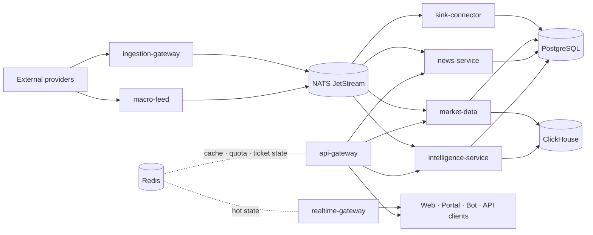

# ATLSD architecture overview

ATLSD is an event-driven, multi-tenant market intelligence platform. The current runtime is split into domain services and workers, connected by versioned contracts and NATS JetStream. Long-term institutional design remains documented separately in [`target-institutional-platform.md`](target-institutional-platform.md); this file describes the current system rather than every roadmap item.

## Runtime layers

### Frontends

- `apps/public-web` — SvelteKit public market dashboard for prices, charts, options, macro signals, sentiment, news, and calendar views.
- `apps/pia/pia` — Next.js portal/admin surface for product, tenant, usage, account, and operational administration.

Both applications are maintained as separate Git submodules with their own package manifests and lockfiles.

### Rust services

- `api-gateway` — authenticated REST entrypoint, routing, API-key usage logging, and quota middleware.
- `realtime-gateway` — authenticated WebSocket connections, subscriptions, snapshots, durable consumers, fanout, and backpressure handling.
- `market-data` — prices, history, sessions, data quality, spikes, rates, economic indicators, energy, COT, options, and Fear & Greed APIs.
- `news-service` — forex/stock news, calendar, source status, macro dashboard, geopolitical signals, SEC data, and central-bank documents.
- `intelligence-service` — text analysis, sentiment, Why Did It Move, factor outputs, and analyzer orchestration.
- `ingestion-gateway` — vendor market-feed sessions, normalization, bounded event publishing, and raw market events.
- `sink-connector` — durable macro-event consumer that materializes rates, spreads, series, bonds, and scraped-news updates into PostgreSQL.
- `control-plane` — users, authentication, plans, API keys, tenant configuration, quotas, and usage.
- `bot` — Discord integration and delivery.
- `db-migrate` — ordered PostgreSQL, ClickHouse, and bot migration runner with checksums and baselining.

### Go and Python workers

- `macro-feed` — FRED rates/spreads and TradingEconomics bond snapshot collection; publishes macro events to NATS.
- `analyzer` — internal FinBERT/language/model runtime used by intelligence workflows.
- `social-worker` — social/X-compatible polling and `social.posts` publishing.

### Shared crates

`crates/` contains authentication/security helpers, common configuration/errors, domain models, versioned event contracts, event-bus adapters, and tracing/observability helpers.

## Current data flow



## Storage responsibilities

- PostgreSQL stores tenant/SaaS state, news, latest prices, macro rates/spreads/series, Fear & Greed records, materialized state, and migration metadata.
- ClickHouse stores market ticks, OHLCV/time-series workloads, volatility data, and analytical reads.
- NATS JetStream provides durable events, consumer acknowledgements, replay, and DLQ workflows.
- Redis provides cache, counters, quota state, short-lived WebSocket tickets, hot state, and transitional compatibility pub/sub.

## Current deployment

Docker Compose is the supported production deployment model. Stacks are separated by lifecycle:

```text
prod.infra.yml  -> datastores and external network atlsd_private
prod.edge.yml   -> edge router and singleton services
prod.app.yml    -> blue/green application services
monitoring.yml  -> monitoring and diagnostics services
```

The application stack rotates stateless services between blue and green Compose projects. The stacks share the external Docker network `atlsd_private`; monitoring joins that network for service discovery and a separate monitoring network for observability components. Kubernetes manifests are not maintained as part of the current runtime.

## Service entrypoints

- REST: `api-gateway`.
- WebSocket: `realtime-gateway`.
- Authentication and tenant administration: `control-plane`.
- Public market dashboard: `public-web`.
- Internal service-to-service traffic and data stores: private network only.

See [`events.md`](events.md), [`ingestion.md`](ingestion.md), [`realtime.md`](realtime.md), and the root [`README.md`](../../README.md) for contracts, operations, and API details.
